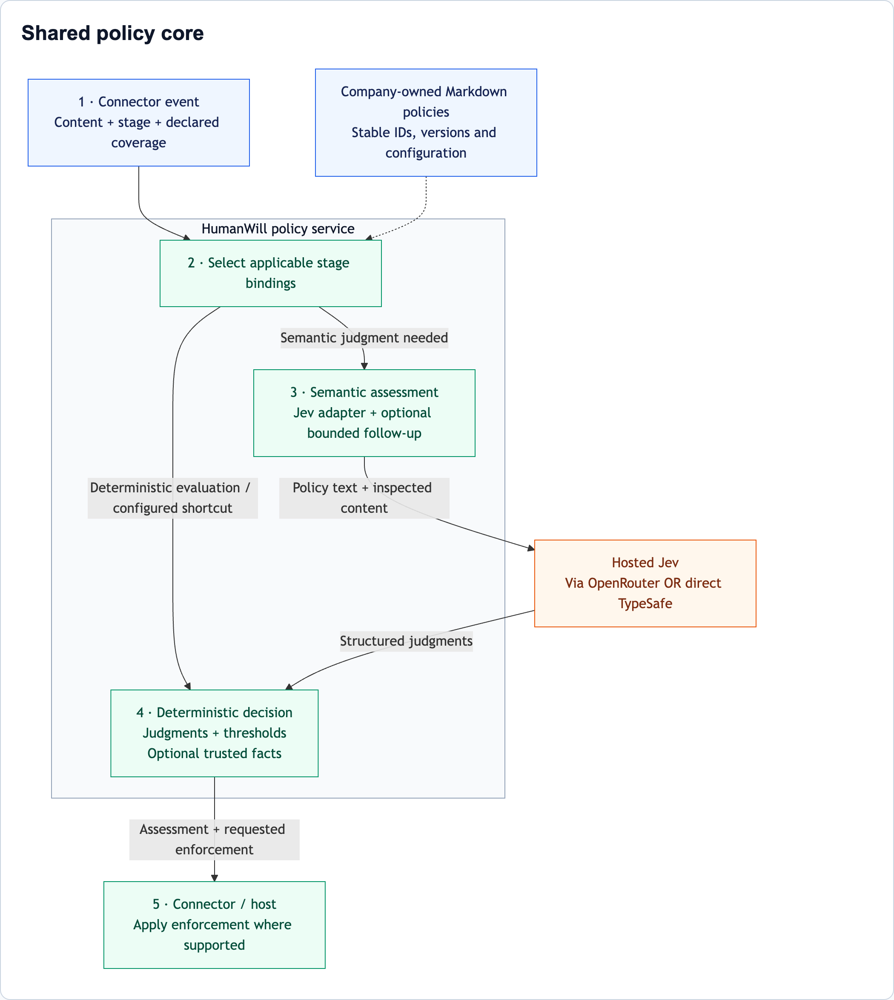
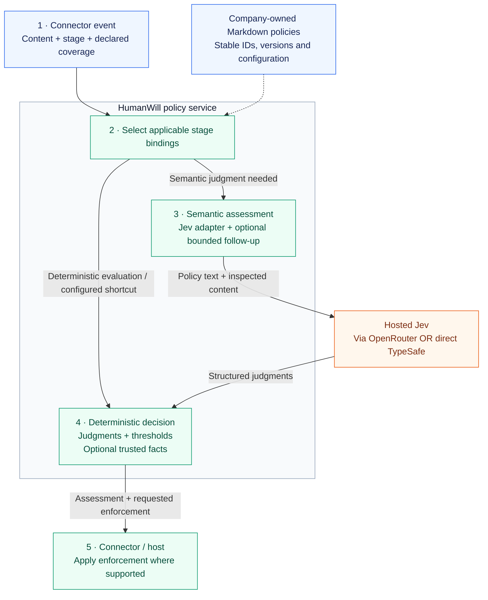
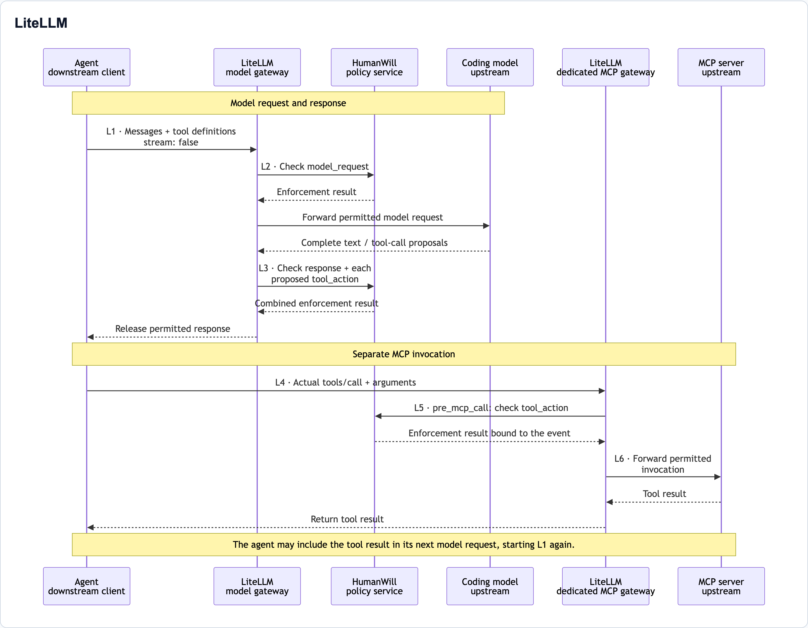
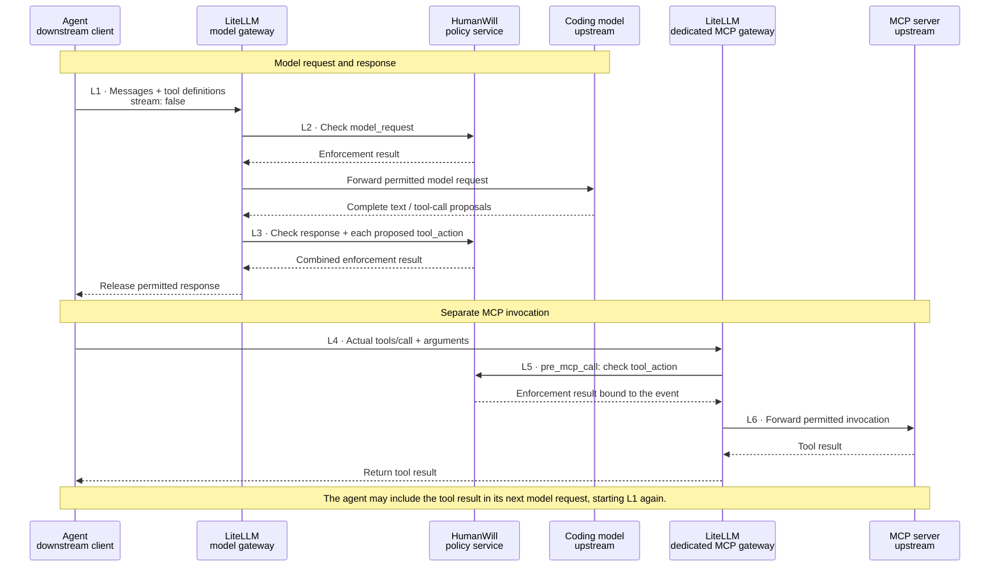
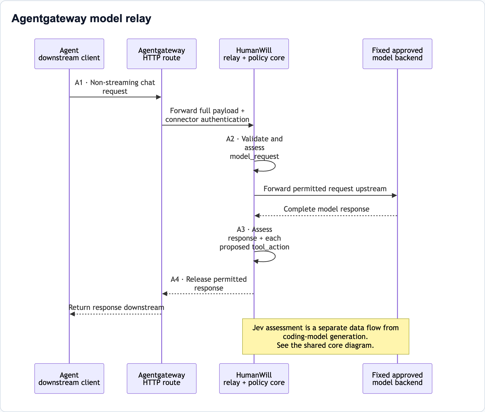
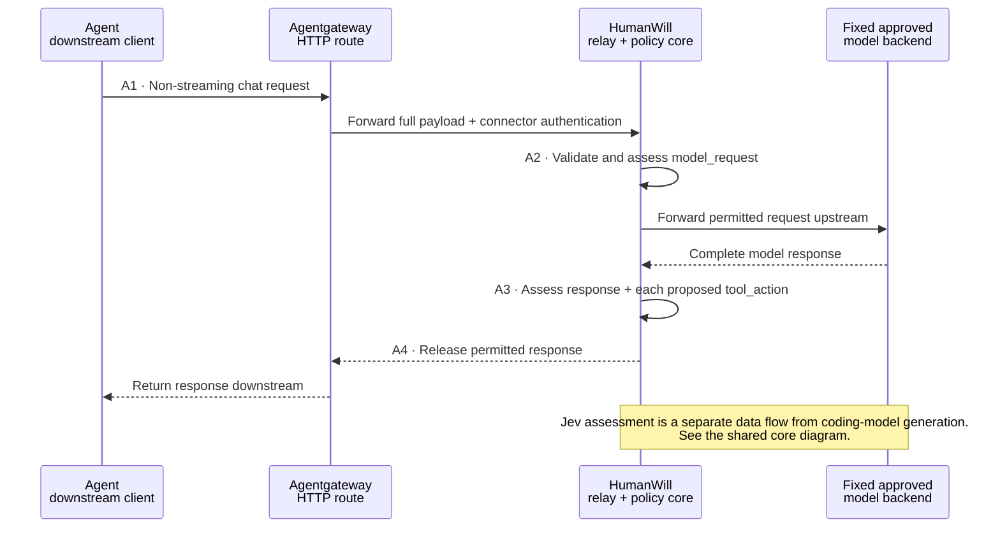
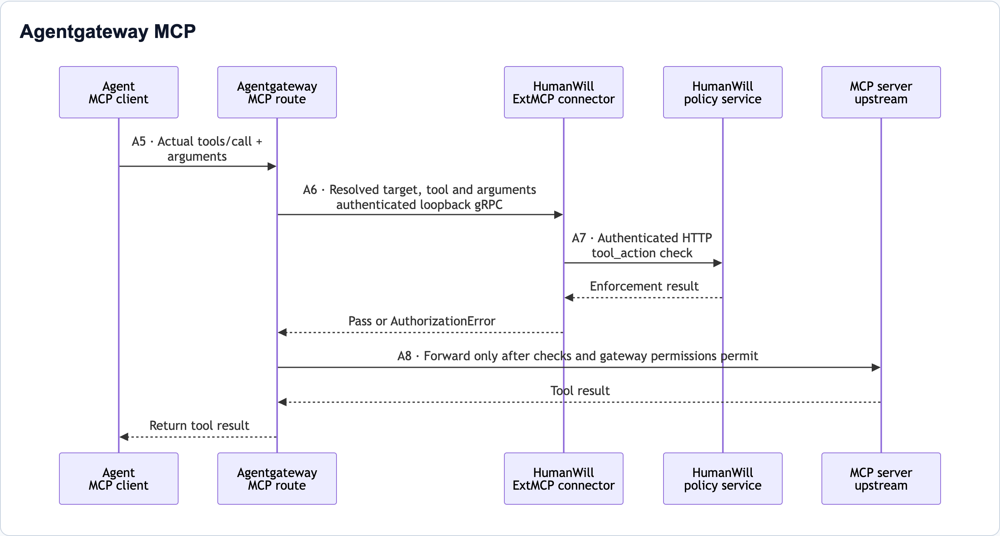
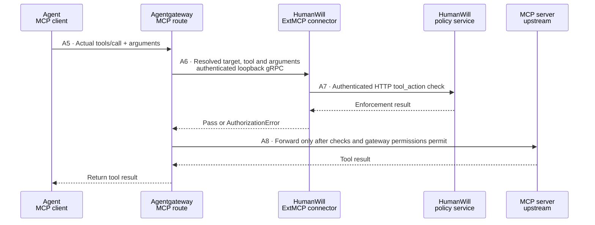
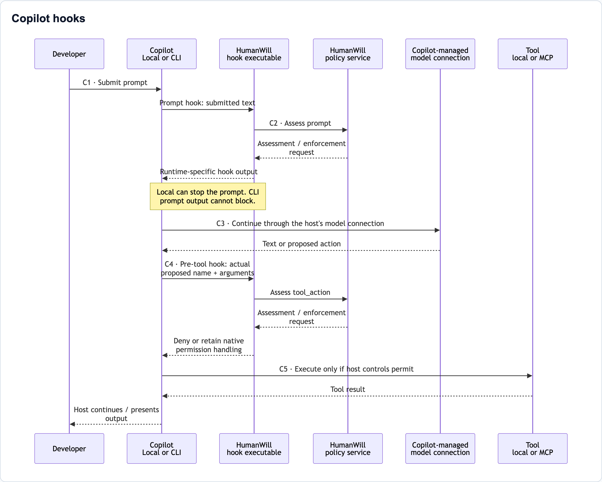
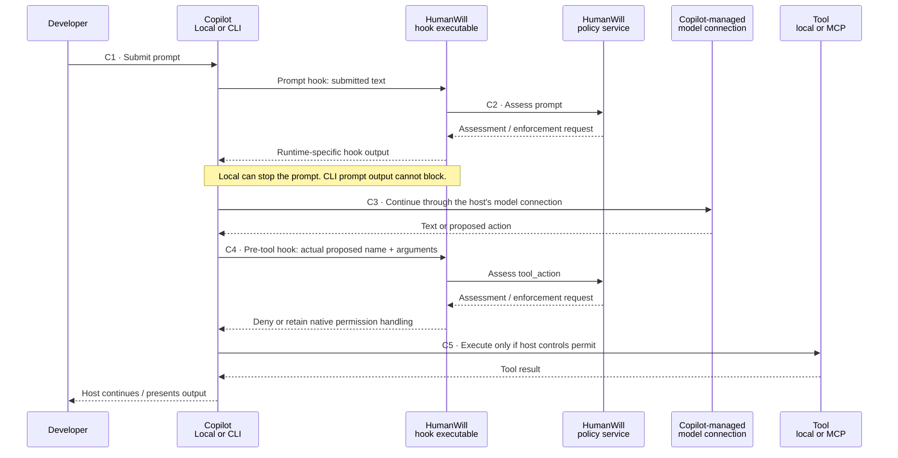

# Architecture and request flows

The diagrams below are PNG images that display directly on GitHub. Each has an
expandable section containing its editable Mermaid source. [Browse the PNG files](assets/architecture/).

HumanWill adds company-policy checks to the path between an agent, its coding
model and its tools. **Jev evaluates the policies; your coding model still does
the development work.** A model's tool proposal and an agent's actual tool
invocation are separate events, with separate inspection points.

This page describes the **0.2 Public Beta**, including explicitly enabled
structured-call and MCP profiles. The earlier `v0.1.0a1` does not contain those
additions. Diagrams describe the implementation verified in the
[beta acceptance record](beta-final-ci-report.md), not universal gateway or Copilot
capabilities. References such as **L3** match the explanations below each diagram.

## Reading the flows

From a gateway's perspective, the **agent is the downstream client**. The coding
model or MCP server is an **upstream service**. Requests travel upstream; replies
travel downstream. These directions describe traffic, not where policy checks
happen: model requests and model responses can both be inspected.

| Component | Responsibility |
| --- | --- |
| Agent | Collects context, requests model output, chooses whether to invoke tools and submits the actual arguments. |
| AI/model gateway | Routes model requests and responses; invokes configured policy checks. |
| MCP gateway | Routes MCP tool calls and applies pre-execution checks. It may use the same gateway product as the model path, with a separate configuration. |
| Coding model | Generates text or proposes tool calls. A proposal does not itself execute the MCP tool. |
| MCP server | Executes an accepted tool invocation and returns its result. |
| HumanWill service | Loads company policies, obtains judgments, applies deterministic decision rules and returns an assessment/enforcement request. |
| Jev | Provides semantic judgments; it is separate from the coding model and does not execute tools. |

The sequence diagrams show a successful path. **An enforced block stops that
path at the check**, so the next forwarding/execution step does not occur.
Monitoring records assessments without policy blocking. Evaluation-error fallback
is configurable; connector/protocol failures have their own documented behavior.

## Shared policy evaluation

Every integration below uses the same policy core. The connector supplies the
event it actually sees; the service does not fetch a repository or reconstruct
missing conversation history automatically.

Editable Mermaid diagram source

| Reference | What happens |
| --- | --- |
| **1** | The connector creates an event such as `model_request`, `response`, `prompt` or `tool_action`. Coverage describes what was available for inspection. |
| **2** | The service uses the configured policy bundle and stage bindings. A prompt-only rule does not automatically govern responses or actions. |
| **3** | When semantic judgment is needed, the adapter constructs the evaluation question and includes policy text and inspected content. Jev is contacted through the selected transport. A configured follow-up can make another evaluation attempt; it does not ask the developer to rewrite the prompt. |
| **4** | HumanWill applies confidence gates, required trusted predicates, policy modes and error fallback. Jev's judgment alone is not proof of authorization. Deterministic policies or configured permission shortcuts can avoid a model call. |
| **5** | The host applies the returned enforcement request. An assessment, a requested block and an observed execution outcome are distinct; a service log alone does not prove a tool ran or was stopped. |

Metadata is optional for content-only policies. When a policy requires trusted
facts, their absence cannot become approval. No production metadata resolver or
approval dialog is supplied. Trusted metadata is checked by the policy core; raw
metadata is not included in Jev payloads by this implementation. Hosted evaluation
sends covered content and policy
text outside the service's environment, even when HumanWill is self-hosted.

See [policy authoring](policy-authoring.md), [optional metadata](optional-metadata.md)
and [bounded follow-ups](bounded-policy-followup.md).

## LiteLLM: model traffic and MCP execution

The beta uses **two separately configured LiteLLM paths**: a model gateway with
the structured-call profile, and a dedicated MCP gateway. The initial MCP profile
must not share the model gateway's chat-only callbacks. Both can call the same
HumanWill service using separate authenticated principals.

Editable Mermaid diagram source

| Reference | What is inspected or enforced |
| --- | --- |
| **L1** | The agent sends supported messages, available history/tool results and tool definitions. Historical calls and definitions are context, not new executions. |
| **L2** | LiteLLM's pre-call guardrail obtains a `model_request` assessment before forwarding. The profile callback validates supported payload shape. |
| **L3** | After generation, the response and each new call's name/parsed arguments are checked. An enforced block withholds the entire response. Nothing here establishes that the agent will later use those identical arguments. |
| **L4** | The agent makes a separate MCP request. This is the actual invocation, potentially with arguments different from the model's proposal. |
| **L5** | The mandatory MCP guardrail checks the actual name/arguments before forwarding, verifies the returned verdict belongs to that event, and detects changes during assessment. A denial prevents the upstream call. |
| **L6** | LiteLLM forwards the permitted invocation. The MCP binding does **not** inspect the returned tool result. If the agent subsequently includes it in a supported model request, that supplied content is inspected at L2. |

Model-proposal inspection and MCP execution checks are independently configured.
Using both can assess similar arguments twice, at different boundaries. A model
response containing sensitive text can matter even if no tool ever executes.
Discovery is not an execution check, and these connectors do not automatically
inspect files or URLs referenced by arguments.

Setup: [structured model profile](structured-tool-calls.md#litellm),
[dedicated MCP profile](mcp-pre-execution.md).

## Agentgateway: a model relay and a separate MCP processor

### Structured model traffic

Agentgateway's pinned text guardrail webhook loses tool-call structure. The beta
structured profile therefore routes complete chat traffic through the **HumanWill
relay**, rather than adding tool support to the text-only webhook.

Editable Mermaid diagram source

| Reference | What happens |
| --- | --- |
| **A1** | Agentgateway preserves the complete supported request on an authenticated HTTP backend route to the relay. |
| **A2** | The relay validates the request and evaluates policies before calling its operator-configured OpenAI-compatible model backend. The client cannot select an arbitrary backend URL. |
| **A3** | The relay buffers the complete non-streaming reply, checks response content and checks each proposed action. These internal assessments use the shared core and Jev when required. |
| **A4** | Only a permitted response travels back through Agentgateway to the agent. An enforced block withholds it. Relay protocol, upstream and deadline failures fail closed. |

The relay adds an HTTP hop and includes generation plus checks in its total
deadline. This path is distinct from the existing text-only webhook setup.
See [relay configuration](structured-tool-calls.md#agentgateway-protected-backend-relay).

### MCP execution

Actual MCP calls use Agentgateway's **ExtMCP request processor**, not the model
relay. The HumanWill gRPC connector translates a check into an HTTP request to
the policy service; the connector does not proxy the tool execution itself.

Editable Mermaid diagram source

| Reference | What happens |
| --- | --- |
| **A5** | The agent invokes a tool through Agentgateway's MCP route. No preceding model proposal is required for this check. |
| **A6** | Agentgateway resolves the configured target and calls the ExtMCP processor with parsed tool arguments. The connector runs in the gateway's network namespace with a loopback-only gRPC listener. |
| **A7** | The connector normalizes the invocation and requests evaluation from the HTTP service. An enforced block becomes `AuthorizationError`. Connector/service failures deny; Agentgateway must also use `failureMode: failClosed`. |
| **A8** | A passed policy check still leaves Agentgateway's normal permissions in force. Only then can it forward to the MCP server. Returned tool results are not checked by this request-only binding. |

The target name identifies routing context; it does not prove destination approval.
Use the processor without later argument mutations and prevent direct MCP-server
access if this is a mandatory control. Setup: [Agentgateway MCP](agentgateway-mcp.md).

## GitHub Copilot: hooks inside the agent runtime

The supported Local and CLI connectors run a small HumanWill executable when the
host invokes a configured hook. **No AI gateway is required for this integration.**
The hook contacts the policy service; it does not proxy Copilot's model connection.

Editable Mermaid diagram source

| Reference | What happens |
| --- | --- |
| **C1–C2** | The hook sends submitted prompt text only. It does not read transcript paths, attachments, files or repository contents from hook input. The supported Local runtime can stop submission; CLI's command-based prompt hook is assessment-only. |
| **C3** | Copilot manages model requests and responses. These hooks do not inspect the complete outgoing model request or final generated answer. A separate gateway path would need its own supported configuration; it is not implied by installing the hooks. |
| **C4** | A supported pre-tool event supplies the tool name and arguments for assessment. Both Local and CLI can deny through their own output contracts. An allow preserves the host's normal permission requirements; it does not automatically approve execution. |
| **C5** | The host decides whether execution proceeds. A tool may be local or MCP-backed where exposed through the supported pre-tool hook. If an MCP call also traverses a configured gateway, its independent pre-execution check can run as another layer. |

| Runtime | Prompt event | Pre-tool event | Important boundary |
| --- | --- | --- | --- |
| VS Code **Local** | `UserPromptSubmit`: can stop | `PreToolUse`: can deny | Local runtime, hook settings, trust and sign-in must be configured. This does not describe Agent Host. |
| Copilot **CLI** | `userPromptSubmitted`: assessment-only | `preToolUse`: can deny | Prompt-hook output is ignored for blocking. Folder trust and the CLI-specific hook contract apply. |

In tested hosts, **disabled hooks and host hook timeouts can bypass enforcement**.
That is different from a service/evaluator timeout handled by the adapter while
the hook is still running. Hooks do not provide universal interception of
GitHub.com chat, inline completions, every IDE or cloud-agent task submission.
See [hook installation and runtime contracts](service-and-connectors.md#install-and-remove-copilot-hooks)
and [security considerations](operations.md#security-considerations).

## Choosing inspection points

| Need | Inspection point |
| --- | --- |
| Check content before sending it to the coding model | Model gateway request check; prompt hooks cover only submitted text. |
| Check generated text or tool proposals before the agent receives them | Model gateway response check; enable structured inspection for function-call payloads. |
| Check the actual invocation before an MCP server receives it | MCP pre-execution connector on the routed call. |
| Govern supported local agent tools | The runtime's pre-tool hook; an MCP gateway does not automatically cover local shell tools. |

Protect gateway routes and hook configuration, and account for alternate paths.
No diagram implies that later mutations, referenced-file contents, a tool's
implementation or its subsequent network activity are automatically inspected.

**Planned: model-response streaming.** The beta model paths above require
non-streaming replies. Future streaming support needs explicit buffering and
release rules for text and tool-call fragments, with latency/cancellation tests.
MCP's existing Streamable HTTP transport does **not** mean streamed coding-model
responses are supported. See the [streaming plan](next-action-plan.md#3-streaming-with-tested-buffering-and-blocking).
