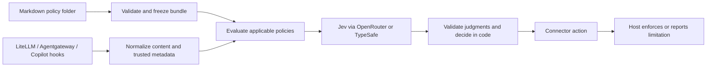

# First-release plan: company-owned policy enforcement

Draft implementation plan · 2026-09-27

The owner requires company/user-authored Markdown policies with stable policy IDs, LiteLLM, Agentgateway, and a Copilot hook connector in the first release, plus direct TypeSafe and OpenRouter access to Jev. Development and testing will use OpenRouter. The design choices below are recommendations, ready to turn into implementation tasks; no runtime exists yet.

## Product promise and boundary

**Bring your own policies, test them against your work, and apply them consistently at supported gateway and agent control points.** The initial customer is an enterprise AI platform/security team managing gateways and coding agents. The useful first product is a deployable service and hook executable with policy provenance and evidence of what was inspected and enforced.

This complements [HumanWill Benchmark](https://github.com/humanwill-ai/humanwill-benchmark): the benchmark measures harmful refusals and usefulness; this project applies explicit company rules. Evaluate both unwarranted blocks and policy violations that pass. Permission from our adapter cannot force a downstream model to answer, override its provider controls, or guarantee compliance with affirmative obligations. Model refusals after an adapter allow must remain a separate measured outcome.

An arbitrary corporate handbook is not automatically an enforceable specification. V0.1 accepts narrow, testable rules with scope and exceptions. Rules needing unavailable evidence must report that limitation. Customer demand and enterprise suitability still need validation; three connectors alone do not establish either.

## 1. Policy folder contract

Recommended authoring layout:

```text
policies/
  policies.md                  # entry point and explicit include list
  data/
    secrets.md                 # one policy with one stable ID
  engineering/
    policies.md                # optional nested collection
    production-changes.md
```

Use Markdown bodies for human-authored rules and a small YAML front matter for machine-readable identity and scope. See [draft examples](../examples/policies/policies.md). One policy per file keeps IDs, tests, and audit references unambiguous. A collection can include policy files or nested collections; all remain under one configured root.

```yaml
---
kind: collection
id: acme-policies
version: "0.1"
includes:
  - data/secrets.md
  - engineering/policies.md
---
```

```yaml
---
kind: policy
id: ACME-SEC-001
version: "1"
title: Protect credentials
stages: [prompt, model_request, tool_action]
---
```

The body defines the rule, exceptions, and examples. `prompt` means submitted text only; `model_request` means the request representation supplied by the gateway, with coverage reported. Stage names describe an event, not a claim that we inspected all related material.

Loader rules:

- Only explicit `includes` activate files. Resolve each path relative to the declaring file. Ordinary Markdown links are documentation, not implicit includes; collection prose is descriptive, not an extra unnamed rule. No globbing or remote fetching in v0.1.
- Parse front matter with a safe, non-executing parser. Reject unknown control fields, missing/duplicate IDs, empty rules, missing files, cycles, non-Markdown includes, absolute paths, and resolved paths outside the root, including symlink escapes. Repeat references to the same canonical file are deduplicated; two different policies sharing an ID are errors.
- Traversal order must not change policy precedence. Every applicable policy is evaluated; a compliant result does not override another policy's violation. Exceptions belong in the owning policy. No inheritance/override language yet. Warn that structural validation cannot detect every prose contradiction.
- Produce a deterministic immutable bundle: source paths, exact content hashes, declared versions, stable IDs, compiler version, and bundle digest. Content changes alter the digest even if the author forgets to increment a version. Explain and preview the effective bundle offline.
- Bound file size, total bundle size, nesting, policy count, and evaluation payload. Limits become explicit configuration with tested defaults in the loader task; never silently truncate policies or content to fit Jev.
- Invalid bundles prevent startup. V0.1 uses restart to activate a new validated bundle; no partial live reload. Empty bundles are invalid, and zero policies applicable to an event produces an explicit `not_applicable` coverage result.

A company controls the installed bundle and deployment settings. Runtime callers cannot supply replacement policy text, lower thresholds, or select a weaker bundle. A developer can own their own local policy set; a company-enforced installation must place its bundle/configuration outside agent-writable project files. Use a read-only mount for the service.

## 2. Small shared core

Recommended stack: **Python 3.11+, one package, FastAPI HTTP endpoints, a small CLI, and HTTPX provider transports**. This aligns with the benchmark's Python ecosystem and LiteLLM without coupling runtime enforcement to benchmark execution. Pin and lock dependency versions during implementation. Do not add a database, queue, or UI initially.



Separate modules: `policies`, `evaluation`, `decision`, `providers`, `connectors`, `api`, and `cli`. The hook executable calls the service; it keeps no Jev credentials and emits only the required host JSON on stdout, with diagnostics on stderr.

Proposed operations: `validate`, `preview`, `evaluate` (offline/mock by default), `serve`, and `hook --runtime ... --event ...`. Names and wire schemas will be frozen with fixtures before connector implementation. Do not install hooks automatically into user projects.

For each policy, start with a fixed, versioned Choice rubric: `compliant`, `violation`, or `insufficient_evidence`. Preserve probability distributions and use thresholds from labeled examples. Do not ask another model to silently rewrite policies. Policy text is trusted evaluator configuration; request content is untrusted evidence. This separation does not eliminate Jev's documented injection susceptibility.

Stage selection and exact metadata predicates run in code. Initially support a small declarative set of trusted metadata presence/equality/membership checks; unsupported predicates fail validation. Semantic authorization inferred from phrases such as “I have permission” is never a substitute. A rule cannot be enabled for enforcement until its required metadata mapping and evaluation profile exist.

Deployment configuration, separate from rule prose, selects bundle, connector credentials, provider/model, modes, calibrated per-policy thresholds, deadlines, and failure actions. It also maps each policy ID to required trusted metadata and any deterministic predicates; the loader does not infer these controls from prose. Hash the effective non-secret configuration alongside the bundle for reproducibility; record credential references, never secret values. No execution of code embedded in Markdown.

## 3. Decisions, uncertainty, and evidence

Return policy IDs/versions, bundle digest, per-policy judgments, decision reasons, requested/returned model identity, transport, timing/usage, and explicit inspection coverage. Required trusted facts carry their source; user-controlled headers are not automatically trusted. Server authentication binds callers to configured bundles and metadata mappings. Single-company deployment is the v0.1 boundary.

| Condition | Core result | Enforcing connector | Monitoring connector |
| --- | --- | --- | --- |
| All applicable policies pass | allow | Permit the covered operation | Record assessment |
| Any policy establishes a violation | block | Deny | Permit, record would-block |
| Missing required facts or uncertain judgment | evaluation_error / indeterminate reason | Apply explicitly configured failure action; proposed default block | Permit, record error/unknown |
| Provider timeout, malformed/missing answer, unsupported payload | evaluation_error | Same explicit failure policy | Permit, record failure |
| No policy applies to the event | allow with `not_applicable` coverage | Proceed with explicit unevaluated coverage | Record no applicable policy |

Keep all per-policy errors even when another policy already blocks. Record configured fail-open as a bypass/error, never a clean policy pass. A service response records the requested action; actual host enforcement remains `unconfirmed` until observable host evidence exists. Correlate host logs and evaluation IDs instead of inventing certainty.

V0.1 implements monitor, allow, and block. Human `review` workflows are deferred; requesting review in configuration is rejected. A future host approval feature must have a real approval path. Default new policies to monitoring; enforced policies require calibrated profiles. Bound the whole evaluation deadline, including network and retries, below the host deadline, but test host-level bypass behavior separately.

## 4. First-release connector scope

All three connector families are release requirements. Build sequentially against the same fixtures; do not label a LiteLLM-only milestone the completed first release.

| Connector | V0.1 supported contract | Explicit exclusions/limits |
| --- | --- | --- |
| LiteLLM | Generic Guardrail API; text pre-call on pinned `/v1/chat/completions` configuration; block before downstream model call | No claim of every LiteLLM endpoint; tool definitions are not tool execution; streaming-output, images and response enforcement deferred |
| Agentgateway | Request webhook with supplied text messages and role provenance; map block to host rejection | Do not copy the example's newest-message-only extraction blindly; report supplied/omitted context; response webhook and MCP execution enforcement deferred |
| Copilot hooks | Two required profiles: VS Code Local `UserPromptSubmit` and `PreToolUse`; CLI `userPromptSubmitted` assessment and `preToolUse` denial | CLI prompt output cannot block; CLI hook timeouts can bypass our result; Local hooks are configurable/trust-dependent; cloud, Agent Host, inline completions and other IDEs excluded initially |

The owner confirmed **both Local and CLI**, with separate fixtures and compatibility entries. Do not merge their schemas. These restrictions follow the [Local reference](https://code.visualstudio.com/docs/agents/reference/hooks-reference) and [GitHub hook reference](https://docs.github.com/en/copilot/reference/hooks-reference); validate pinned versions before release.

Hooks govern only their invocation point and supplied payload. Even a denied tool call does not undo earlier effects. Local hooks editable or disabled by a user are not a company-wide mandatory control. Enterprise pilots need centrally managed configuration and controlled routing around the service; v0.1 documents these deployment prerequisites rather than building endpoint management.

## 5. Jev transports

Use one internal evaluation interface and two transport implementations:

| Transport | Planned endpoint | Initial explicit model ID |
| --- | --- | --- |
| OpenRouter — default for development/tests | `POST https://openrouter.ai/api/alpha/decisions` | `typesafe/jev-1.13` |
| Direct TypeSafe | `POST https://api.typesafe.ai/v1/systemone` | `jev-1.13.0` |

The [OpenRouter Jev guide](https://openrouter.ai/blog/tutorials/how-to-use-jev/) documents typed Decisions requests; the [direct API](https://docs.typesafe.ai/api) documents System One. Keep endpoint/model differences explicit. Contract-test responses; do not assume alias resolution, token limits, billing, or outputs are identical. Never silently switch routes on failure. OpenRouter's alpha endpoint is an upstream compatibility risk to isolate in the transport.

Batch applicable questions when within measured context/deadline budgets. If splitting is needed, aggregate every required result before allowing; a missing batch cannot become pass. Do not implement semantic policy retrieval or a decision cache initially, since missed policies and stale/context-insensitive decisions would complicate correctness.

Development uses synthetic policies and examples through OpenRouter. Production data flow is host → our service → OpenRouter → TypeSafe, or directly to TypeSafe. **Both company rule text and evaluated content can leave the environment.** Check evaluator-destination authorization in code before making that call; blocking transmission to the main model is too late to protect content already sent to Jev. A customer that cannot send the relevant data to either hosted route is outside this first release's supported deployment. Retention, geographic routing, and enterprise terms must be checked before a private customer pilot. Keep secrets out of source; use environment credential references. Logs default to IDs, digests, outcomes, coverage, and timings rather than raw content. Paid run budgets and actual credentials are still needed before execution.

## 6. Build order and acceptance

| Milestone | Deliverable | Completion evidence |
| --- | --- | --- |
| M1 — offline foundation | Package/CLI, folder loader, frozen bundle, `validate`/`preview`, synthetic examples | Tests for include graph, stable IDs/hashes, traversal escapes, malformed metadata and version changes; works without credentials |
| M2 — first vertical slice | Mock evaluator, OpenRouter transport, deterministic decision engine, `evaluate` | One request produces policy-linked results; malformed answers/uncertainty/timeouts handled; opt-in budgeted synthetic OpenRouter smoke run |
| M3 — gateway connections | Authenticated service, LiteLLM and Agentgateway adapters, direct Jev transport | Each gateway prevents a mock downstream invocation on deny; allow/error/unsupported fixtures; direct transport contract and live smoke when credentials are available |
| M4 — Copilot connections | Hook executable and separate selected runtime profiles | Local deny/stop and CLI assessment/deny verified on pinned versions; controlled tool not executed on denial; timeout and disabled-hook behavior documented |
| M5 — v0.1 private alpha | Installation/configuration examples, container recipe, compatibility matrix, evaluation report | Three connector families, both transports, privacy defaults, rollback instructions, and no untested enforcement claim |

Start M1 immediately after this planning step; it does not depend on live API access or customer interviews. During M1, cap the reuse review at one focused comparison of the benchmark policy snapshot helpers and `jev-edge` adapter fixtures. Prefer narrowly reusable pieces with appropriate licensing; the gateway-oriented `jev-edge` runtime is not the default foundation for this Markdown/API/hook product. Reconsider if the comparison demonstrates substantial reuse.

Test three narrow policies on legitimate work, violations, exceptions, missing evidence, and direct/indirect injection. Compare Jev with deterministic checks and one suitable alternative judge. Keep held-out cases separate from policy examples. Report false blocks, missed violations, errors, coverage gaps, host bypasses, p50/p95/p99 added latency, and total cost; see [evaluation plan](evaluation-plan.md). The benchmark's FR/usefulness metrics and labels do not automatically measure harmful compliance or this service's enforcement.

V0.1 is a private alpha for controlled trials, not a claim of enterprise readiness. No governance console, SSO/RBAC administration, multi-tenant SaaS, general policy language, signed bundle distribution, universal agent coverage, or approval workflow in this release.

## Remaining owner decisions

1. Supply the first three real policy intentions with allowed/blocked examples; synthetic examples unblock engineering now.
2. Choose a development-call budget before live runs. Customer data/retention constraints and quality thresholds are needed before a customer pilot, not before the offline loader.
