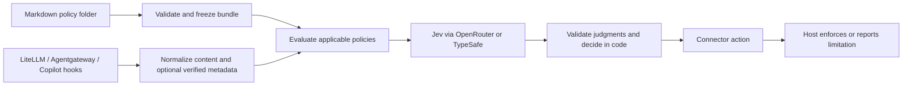

# First-release plan: company-owned policy enforcement

Implementation plan · updated 2026-09-27

The owner requires company/user-authored Markdown policies with stable policy IDs, LiteLLM, Agentgateway, and a Copilot hook connector in the first release, plus direct TypeSafe and OpenRouter access to Jev. Development and testing will use OpenRouter. The offline foundation is implemented; the [contract reference](contracts.md) defines its exact behavior and the [foundation report](foundation-report.md) records checks. The evaluation core and both provider adapters are now implemented with synthetic contract tests; OpenRouter live smoke passed; service/gateway/CLI/Local integrations now have runtime evidence. Direct TypeSafe live smoke is optional for v0.1. See the [core reference](evaluation-core.md).

The [public-release roadmap](public-release-plan.md) now defines delivery order and publication gates for a proposed `v0.1.0a1` public preview. This document defines technical scope; private validation remains a step toward publication, not the final release objective.

## Product promise and boundary

**Bring your own policies, test them against your work, and apply them consistently at supported gateway and agent control points.** The initial customer is an enterprise AI platform/security team managing gateways and coding agents. The useful first product is a deployable service and hook executable with policy provenance and evidence of what was inspected and enforced.

This complements [HumanWill Benchmark](https://github.com/humanwill-ai/humanwill-benchmark): the benchmark measures harmful refusals and usefulness; this project applies explicit company rules. Evaluate both unwarranted blocks and policy violations that pass. Permission from our adapter cannot force a downstream model to answer, override its provider controls, or guarantee compliance with affirmative obligations. Model refusals after an adapter allow must remain a separate measured outcome.

An arbitrary corporate handbook is not automatically an enforceable specification. V0.1 accepts narrow, testable rules with scope and exceptions. Rules needing unavailable evidence must report that limitation. Customer demand and enterprise suitability still need validation; three connectors alone do not establish either.

## 1. Policy folder contract

Recommended authoring layout:

```text
policies/
  policies.md                  # entry point and explicit include list
  data/
    secrets.md                 # one policy with one stable ID
  engineering/
    policies.md                # optional nested collection
    production-changes.md
```

Use Markdown bodies for human-authored rules and a small YAML front matter for machine-readable identity and scope. See [authoring examples](../examples/policies/policies.md). One policy per file keeps IDs, tests, and audit references unambiguous. A collection can include policy files or nested collections; all remain under one configured root.

```yaml
---
kind: collection
id: acme-policies
version: "0.1"
includes:
  - data/secrets.md
  - engineering/policies.md
---
```

```yaml
---
kind: policy
id: ACME-SEC-001
version: "1"
title: Protect credentials
stages: [prompt, model_request, tool_action]
---
```

The body defines the rule, exceptions, and examples. `prompt` means submitted text only; `model_request` means the request representation supplied by the gateway, with coverage reported. `response` checks generated content before delivery, and `tool_action` checks the exact proposed action before execution. A pass at one stage does not authorize another. Stage names describe an event, not a claim that we inspected all related material.

Loader rules:

- Only explicit `includes` activate files. Resolve each path relative to the declaring file. Ordinary Markdown links are documentation, not implicit includes; collection prose is descriptive, not an extra unnamed rule. No globbing or remote fetching in v0.1.
- Parse front matter with a safe, non-executing parser. Reject unknown control fields, missing/duplicate IDs, empty rules, missing files, cycles, non-Markdown includes, absolute paths, and resolved paths outside the root, including symlink escapes. The implemented loader rejects all symlinks beneath the root, even internal aliases. Repeat references to the same canonical file are deduplicated; two different policies sharing an ID are errors.
- Traversal order must not change policy precedence. Every applicable policy is evaluated; a compliant result does not override another policy's violation. Exceptions belong in the owning policy. No inheritance/override language yet. Warn that structural validation cannot detect every prose contradiction.
- Produce a deterministic immutable bundle: source paths, exact content hashes, declared versions, stable IDs, compiler version, and bundle digest. Content changes alter the digest even if the author forgets to increment a version. Explain and preview the effective bundle offline.
- Bound file size, total bundle size, nesting, policy count, and evaluation payload. Limits become explicit configuration with tested defaults in the loader task; never silently truncate policies or content to fit Jev.
- Invalid bundles prevent startup. V0.1 uses restart to activate a new validated bundle; no partial live reload. Empty bundles are invalid, and zero policies applicable to an event produces an explicit `not_applicable` coverage result.

A company controls the installed bundle and deployment settings. Runtime callers cannot supply replacement policy text, lower thresholds, or select a weaker bundle. A developer can own their own local policy set; a company-enforced installation must place its bundle/configuration outside agent-writable project files. Use a read-only mount for the service.

## 2. Small shared core

Recommended stack: **Python 3.11+, one package, Starlette/Uvicorn HTTP endpoints, a small CLI, and HTTPX provider transports**. This aligns with the benchmark's Python ecosystem and LiteLLM without coupling runtime enforcement to benchmark execution. Pin and lock dependency versions during implementation. Do not add a database, queue, or UI initially.



Separate modules: `policies`, `evaluation`, `decision`, `providers`, `connectors`, `api`, and `cli`. The hook executable calls the service; it keeps no Jev credentials and emits only the required host JSON on stdout, with diagnostics on stderr.

Proposed operations: `validate`, `preview`, `evaluate` (offline/mock by default), `serve`, and `hook --runtime ... --event ...`. The implemented commands are `validate`, `preview`, `init-demo`, and `schema`; candidate wire schemas have offline fixtures. `evaluate` is now implemented; `serve` and `hook` are implemented; see [service/connector reference](service-and-connectors.md). Do not install hooks automatically into user projects.

For each policy, start with a fixed, versioned Choice rubric: `compliant`, `violation`, or `insufficient_evidence`. Preserve probability distributions and use thresholds from labeled examples. Do not ask another model to silently rewrite policies. Policy text is trusted evaluator configuration; request content is untrusted evidence. This separation does not eliminate Jev's documented injection susceptibility.

**Metadata is optional and independently switchable**, recommended off by default. Content-only policies work without identity, groups, classification, or destination fields. With metadata enabled, use only configured sources and policy-required fields; the normalized metadata object remains optional. See [optional metadata and stage checks](optional-metadata.md) for the switch, examples, dependency handling, and trust contract. This switch never disables connector authentication.

Stage selection and exact metadata predicates run in code. Initially support a small declarative set of trusted metadata presence/equality/membership checks; unsupported predicates fail validation. Semantic authorization inferred from phrases such as “I have permission” is never a substitute. A metadata-dependent rule cannot be enabled for enforcement until its feature/source mapping and evaluation profile exist. Disabling metadata requires explicitly monitoring or disabling dependent rules; it must not silently convert them to passes.

Deployment configuration, separate from rule prose, selects bundle, connector credentials, provider/model, modes, calibrated per-policy thresholds, deadlines, and failure actions. It also maps each policy ID to required trusted metadata and any deterministic predicates; the loader does not infer these controls from prose. Hash the effective non-secret configuration alongside the bundle for reproducibility; record credential references, never secret values. No execution of code embedded in Markdown.

## 3. Decisions, uncertainty, and evidence

Return policy IDs/versions, bundle digest, per-policy judgments, decision reasons, requested/returned model identity, transport, timing/usage, and explicit inspection coverage. Required trusted facts carry their source; user-controlled headers are not automatically trusted. Server authentication binds callers to configured bundles and metadata mappings. Single-company deployment is the v0.1 boundary.

| Condition | Core result | Enforcing connector | Monitoring connector |
| --- | --- | --- | --- |
| All applicable policies pass | allow | Permit the covered operation | Record assessment |
| Any policy establishes a violation | block | Deny | Permit, record would-block |
| Missing required facts or uncertain judgment | evaluation_error / indeterminate reason | Apply explicitly configured failure action; proposed default block | Permit, record error/unknown |
| Provider timeout, malformed/missing answer, unsupported payload | evaluation_error | Same explicit failure policy | Permit, record failure |
| No policy applies to the event | allow with `not_applicable` coverage | Proceed with explicit unevaluated coverage | Record no applicable policy |

Keep all per-policy errors even when another policy already blocks. Record configured fail-open as a bypass/error, never a clean policy pass. A service response records the requested action; actual host enforcement remains `unconfirmed` until observable host evidence exists. Correlate host logs and evaluation IDs instead of inventing certainty.

V0.1 implements monitor, allow, and block. Human `review` workflows are deferred; requesting review in configuration is rejected. A future host approval feature must have a real approval path. Default new policies to monitoring; enforced policies require calibrated profiles. Bound the whole evaluation deadline, including network and retries, below the host deadline, but test host-level bypass behavior separately.

## 4. First-release connector scope

All three connector families are release requirements. Build sequentially against the same fixtures; do not label a LiteLLM-only milestone the completed first release.

| Connector | V0.1 supported contract | Explicit exclusions/limits |
| --- | --- | --- |
| LiteLLM | Generic Guardrail API; text pre-call and non-streaming post-call on pinned `/v1/chat/completions` configuration; block requests before model calls or responses before delivery | No claim of every LiteLLM endpoint; tool definitions are not tool execution; streaming-output and images deferred |
| Agentgateway | Request and non-streaming response webhooks with supplied text/role provenance; map block to host rejection | Do not copy the example's newest-message-only extraction blindly; report supplied/omitted context; MCP execution enforcement deferred |
| Copilot hooks | Two required profiles: VS Code Local `UserPromptSubmit` and `PreToolUse`; CLI `userPromptSubmitted` assessment and `preToolUse` denial | CLI prompt output cannot block; CLI and Local host hook timeouts can bypass our result; Local hooks are configurable/trust-dependent; cloud, Agent Host, inline completions and other IDEs excluded initially |

The owner confirmed **both Local and CLI**, with separate fixtures and compatibility entries. Do not merge their schemas. These restrictions follow the [Local reference](https://code.visualstudio.com/docs/agents/reference/hooks-reference) and [GitHub hook reference](https://docs.github.com/en/copilot/reference/hooks-reference); validate pinned versions before release.

Response hooks are documented by [LiteLLM](https://docs.litellm.ai/docs/adding_provider/generic_guardrail_api) and the inspected [Agentgateway example](https://github.com/agentgateway/agentgateway/tree/7e47ceb576aa9d3300cb0d2c7c35848fb0af048f/examples/llm-guardrail-jev). The new response scope remains untested. Require evidence that no response content reaches the consumer before the verdict; reject enforcement bindings for stages a connector cannot intercept. Copilot final-answer enforcement is not established by its prompt/pre-tool hooks.

Hooks govern only their invocation point and supplied payload. Even a denied tool call does not undo earlier effects. Local hooks editable or disabled by a user are not a company-wide mandatory control. Enterprise pilots need centrally managed configuration and controlled routing around the service; v0.1 documents these deployment prerequisites rather than building endpoint management.

## 5. Jev transports

Use one internal evaluation interface and two transport implementations:

| Transport | Planned endpoint | Initial explicit model ID |
| --- | --- | --- |
| OpenRouter — default for development/tests | `POST https://openrouter.ai/api/alpha/decisions` | `typesafe/jev-1.13` |
| Direct TypeSafe | `POST https://api.typesafe.ai/v1/systemone` | `jev-1.13.0` |

The [OpenRouter Jev guide](https://openrouter.ai/blog/tutorials/how-to-use-jev/) documents typed Decisions requests; the [direct API](https://docs.typesafe.ai/api) documents System One. Keep endpoint/model differences explicit. Contract-test responses; do not assume alias resolution, token limits, billing, or outputs are identical. Never silently switch routes on failure. OpenRouter's alpha endpoint is an upstream compatibility risk to isolate in the transport.

Batch applicable questions when within measured context/deadline budgets. If splitting is needed, aggregate every required result before allowing; a missing batch cannot become pass. Do not implement semantic policy retrieval or a decision cache initially, since missed policies and stale/context-insensitive decisions would complicate correctness.

Development uses synthetic policies and examples through OpenRouter. Production data flow is host → our service → OpenRouter → TypeSafe, or directly to TypeSafe. **Both company rule text and evaluated content can leave the environment.** Check evaluator-destination authorization in code before making that call; blocking transmission to the main model is too late to protect content already sent to Jev. A customer that cannot send the relevant data to either hosted route is outside this first release's supported deployment. Retention, geographic routing, and enterprise terms must be checked before a private customer pilot. Keep secrets out of source; use environment credential references. Logs default to IDs, digests, outcomes, coverage, and timings rather than raw content. A $5 total synthetic smoke cap is approved and the OpenRouter Keychain credential was used successfully. Direct TypeSafe live smoke is optional for v0.1. Broader semantic-evaluation budgets remain outstanding.

## 6. Build order and acceptance

| Milestone | Deliverable | Completion evidence |
| --- | --- | --- |
| M1 — offline foundation | Package/CLI, folder loader, frozen bundle, `validate`/`preview`, synthetic examples | Tests for include graph, stable IDs/hashes, traversal escapes, malformed metadata and version changes; works without credentials |
| M2 — first vertical slice | Mock evaluator, OpenRouter transport, deterministic decision engine, optional metadata switch/predicates, `evaluate` | Content-only operation needs no metadata; disabled mode performs no enrichment; missing/spoofed facts are not permissions; malformed answers/uncertainty/timeouts handled; opt-in budgeted synthetic OpenRouter smoke run |
| M3 — gateway connections | Authenticated service, LiteLLM and Agentgateway request/response adapters, direct Jev transport | Each gateway prevents a mock downstream invocation on request deny and withholds response content on response deny; metadata toggles leave connector authentication intact; allow/error/unsupported fixtures; direct transport contract and live smoke when credentials are available |
| M4 — Copilot connections | Hook executable and separate selected runtime profiles | Local deny/stop and CLI assessment/deny verified on pinned versions; controlled tool not executed on denial; timeout and disabled-hook behavior documented |
| M5 — public-preview candidate | Installation/configuration examples, container recipe, compatibility matrix, evaluation report | Three connector families, both transports, privacy defaults, rollback instructions, and no untested enforcement claim; then complete public-release roadmap gates |

M1 is implemented with offline tests and package checks; see the [foundation report](foundation-report.md). The bounded [reuse review](compatibility.md) found that an original compiler avoids importing benchmark scoring contracts or `jev-edge` fail-open runtime behavior. M2 software is implemented, including both transports (direct TypeSafe moved forward from M3). Its OpenRouter live smoke passed; direct TypeSafe live smoke is optional; see [step 3 evidence](evaluation-core-report.md).

Test three narrow policies on legitimate work, violations, exceptions, missing evidence, and direct/indirect injection. Compare Jev with deterministic checks and one suitable alternative judge. Keep held-out cases separate from policy examples. Report false blocks, missed violations, errors, coverage gaps, host bypasses, p50/p95/p99 added latency, and total cost; see [evaluation plan](evaluation-plan.md). The benchmark's FR/usefulness metrics and labels do not automatically measure harmful compliance or this service's enforcement.

The proposed first public version is an alpha preview, validated privately before publication, not a claim of enterprise readiness. No governance console, SSO/RBAC administration, multi-tenant SaaS, general policy language, signed bundle distribution, universal agent coverage, or approval workflow in this release.

## Remaining owner decisions

1. Review the new [case-label packet](step6-review-candidates-v1.md), then establish the independent held-out sampling/review protocol. The three policy intentions, $5 cumulative synthetic budget and numerical targets are already recorded.
2. Choose the project license and publication/security reporting details before step 8. Customer data/retention constraints remain necessary before a pilot.

## Inbound source-policy extension — 2026-09-28

Add the owner-requested approved-software-source policy and an operator-managed
allowlist supporting company mirrors and approved public sources. The
[design and current evidence](approved-software-sources.md) separate the completed
policy/configuration/reference matching and review cases from pending production
origin resolution, host wiring and live policy-quality measurements. Cover actual
package/dependency/redirect origins before making enforcement claims. Preserve
the historical three-policy profile and frozen review datasets.

## Active 100-case review correction — 2026-09-28

The active packet now includes EVAL-SRC-001 alongside the original named policy
for all 100 events; see [the revised review](holdout-sources-v2-review.md).
The direct dependency tarball is unapproved and the combined expected result is
block. Original review records remain historical; the expanded checks need review.
The old live runner/protocol remains single-policy historical evidence and does
not establish the new suite’s quality. No new model calls were made.

## Narrower release scope — 2026-09-28

Owner accepted keeping advanced command interpretation as documented diagnostics
outside first-release acceptance. [Release scope v1](release-scope-v1.md) applies
input/capability criteria to all 175 accepted cases: 102 generic-policy cases and
73 advanced diagnostics (including 66 passing cases). No case, label, approval or
historical result is deleted; no runtime allow/bypass is added. This is a
post-measurement scope decision, not improved or independent accuracy evidence.
Two generic combined failures remain: explanation-only prompt and unapproved Git
fetch, both correct Jev choices rejected by the unchanged confidence gate. A source
error on an empty response is masked by a correct document block. Production
policy has only one generic example after this split; representative structured
action cases are required before claiming its quality. Statistical, latency and
production-resolver gates remain open. No provider calls or new spending.

## Global outcome thresholds — 2026-09-28

Owner authorized three configurable confidence gates shared across all policies,
rather than per-policy asymmetric settings. Implemented as opt-in config/4; see
[outcome thresholds](outcome-thresholds.md). All three default to 0.80, old configs
and historical evidence remain unchanged, and config/4 rejects legacy per-policy
thresholds. Scope applicability still requires deterministic authorization;
uncertainty handling and connector enforcement remain separate. Content-only
violation/compliant answers share the applicable/not_applicable gates. Result/3
remains compatible with existing connectors. Offline validation is not calibration:
no new live calls or spending, no qualified asymmetric enforcement profile, and
release quality gates remain open.


## Actual-policy evaluation update — 2026-09-28

Owner approved replacing manually authored semantic scope questions with the actual Markdown policy and a reusable adapter template. Opt-in config/5/result/4 implements this direction; trusted metadata and deterministic predicates stay separate, optional and explicitly configured. See [design, migration and validation limits](direct-policy-evaluation.md). Existing model evidence does not validate the new template; a fresh full-pack Jev run remains required before quality claims or enforcement qualification. No publication/default enforcement change.


## Full-policy live result — 2026-09-28

The authorized full175 Jev/OpenRouter pass completed at d624c9c with unchanged policies, labels, context, model, monitor modes and 0.80 gates. The shared-template path regressed: 142/175 exact events vs166, 228/272 policy outcomes vs260, fail-closed false blocks32/79 vs6, known violations allowed0/84, expected unknowns retained12/12. Raw scope errors12/226 (one malformed response) vs2/227; correct raw choices rejected for low confidence35 vs12. No tuning/reruns. See [full report](direct-policy-live-v1-report.md). Keep the new template experimental and preserve the previous measured path; release quality remains open. Cost $0.010850028, cumulative $0.089128796, remaining $4.910871204. All1560 cumulative evaluation calls settled. One normalized batch lacks usage after answer validation failure; its transport cost is settled and included.


## Patch-confidence experiment — 2026-09-28

Owner requested100 live synthetic variations to investigate low confidence. Completed50 distinct requests x2 repetitions,100 calls,200 scope questions at clean65dc823. See [protocol](patch-diagnostics-v1-protocol.md) and [report](patch-diagnostics-v1-report.md). Frozen randomized order, no retries, runtime policies/template/gates unchanged.36 scored diagnostic judgments per condition (new labels provisional), four source-origin judgments unscored: correct accepted baseline15,tool context27,focused question30,concise policy16,concise+focused28. Explicit local provenance helps source confidence but not enough for disclosure; focused restricted-action wording is a more promising next experiment than simply shortening policies. All positive controls accepted. Two malformed responses have probabilities summing0.99; strict current validation retained. Not independent quality evidence or causal proof. Cost$0.008754060; total$0.097882856; remaining$4.902117144; all1660 cumulative calls settled.


## Focused full-policy pass — 2026-09-28

Owner accepted testing the focused question on all175 with brief context where needed. Completed at636cb85: full policies/labels unchanged, active0.80/0.70/0.80 gates, one neutral git-apply note,148 calls with no retries. Against recorded answers replayed at the same gates:156/175 vs151 exact,248/272 vs242 policy matches,14/79 vs23 fail-closed false blocks,0/84 known violations allowed,12/12 expected unknowns retained.13 fixes and8 regressions; disclosure improves but source/production policy results regress. Git-apply passes with source confidence0.77/disclosure0.93. Keep candidate experimental; no runtime template promotion. See [report](focused-policy-v1-report.md) and [protocol](focused-policy-v1-protocol.md). Run cost$0.010737426,total$0.108620282,remaining$4.891379718; all1808 cumulative calls settled. No malformed responses in this pass, strict validation unchanged.


## Nine-error diagnosis and incomplete effect-question experiment — 2026-09-28

Reviewed the remaining nine legitimate errors and prepared neutral tool descriptions
plus a shared question clarification. The broader question candidate regressed five
previously passing cases in the first11 paired events; do not promote it. A provider
timeout stopped the planned two-arm full-pack run after23 calls (22 priced replies,
one unresolved charge). No target case is demonstrated fixed; only base64 returned
new judgments, while tar timed out and the other seven were not reached. See the
[case-by-case findings and partial report](effect-question-v1-report.md). Keep the
smaller focused-policy-v2 candidate separate from tool-context experiments. Policies,
labels, runtime template, gates and release qualification remain unchanged. Known
cumulative spend$0.110940572 plus$0.01 reserved for the unresolved call; no further
provider calls until accounting is reconciled. Local source commit e1751bc; no push.


## Restart completed — 2026-09-29

Owner-requested fresh two-arm test completed at dd975e7:175 events per arm,296 new
calls, all new charges settled. Question-only149/175 exact; question+context156/175
versus saved baseline156. Context fixes4 of the nine target cases but still has
16 legitimate errors and3 known-violation errors; no known violation/expected unknown
is allowed.11 fixes and11 regressions against baseline; do not promote the broader
wording. [Full results](effect-question-restart-v1.md) distinguish changed context
from identical-payload variation and preserve the original interrupted attempt.
Known cumulative spend$0.135761732 plus the owner-authorized carried$0.01 unresolved
reservation; total accounted$0.145761732, remaining$4.854238268. No runtime change,
release qualification or GitHub push.

## Short-question experiment — 2026-09-29

Completed the requested ten-variant wording experiment: 682 calls, with all new charges settled. Q05 and Q02 are candidates only; quality gates remain open. A future full-pack comparison must retain regressions and separate false blocks, missed violations and evaluation errors. See [measured results](short-questions-v1-report.md).

## Q05 full-pack results — 2026-09-29

Completed all 175 reviewed cases with the frozen Q05 template: 149 definitive
decisions, all matching event labels; 26 inconclusive results (14.9%), of which
12 were expected and 14 unexpected (8.6% of 163 decidable cases). Fail-closed
would stop 9/79 legitimate requests; fail-open would permit 5/84 known violations
and all 12 expected unknowns. This remains above the initial error target.
No runtime default or release-readiness change. See [full measured results](q05-full-pack-v1-report.md).

## Policy-isolation experiment — 2026-09-29

Three fresh full-pack passes compared identical Q05 retry, isolated Q05 and
isolated Q04 after a shared primary. Isolation alone gave little improvement.
Isolated Q04 reduced unexpected abstention to 4.9%, 6.1% and 5.5%, with no wrong
accepted event/policy outcomes and all expected unknowns retained. This is promising
follow-up evidence, not a consistently met 5% target or proof that isolation causes
the improvement. No classifier, policy change or runtime adoption. See
[full results](policy-isolation-v1-report.md); discuss the next experiment before proceeding.

## Q04 follow-up comparison — 2026-09-29

Three paired passes of the 175 reviewed cases plus 24 provisional fresh workflows
are complete at frozen source `03c72bb`. Reviewed unexpected errors per 163 cases:
Q05 15/15/15, full-batch Q04 10/9/10, isolated Q04 11/10/10; pooled rates are
9.2%, 5.9% and 6.3%. Fresh errors per 20 decidable cases: Q05 1/3/2, both
follow-ups 1/2/1 (6.7% pooled). No wrong definitive event or policy decisions;
all expected unknowns preserved. Fresh labels are model-authored and pending
review, not independent qualification. Prefer bounded full-batch Q04 as the
simpler next implementation candidate; isolation has no demonstrated advantage
and the 5% goal remains unmet. See [full report](q04-comparison-v1-report.md).
624 calls cost $0.037072056; known total $0.260080178 plus the historical $0.01
reservation, leaving $4.729919822. All new charges settled. No runtime, classifier,
policy, threshold or release change, and no push. Experiment complete;
no automatic additional campaign.

## Bounded Q04 runtime implementation — 2026-09-29

Owner authorized implementing the full-batch follow-up. Config/5 now supports
`policy_assessment: q05_q04`: Q05 first, at most one Q04 call for eligible
low-confidence scope answers, with unchanged gates, trusted metadata checks and
error fallback. Existing configurations retain their behavior. Result/4 includes
normalized primary/secondary evidence and usage for both attempts. See the
[runtime contract](bounded-policy-followup.md) and [verification](bounded-policy-followup-verification.md).
231 offline tests and 12 Python 3.11 focused tests pass; all 597 saved event views
replay exactly across 569 recorded payloads. Exact wheel/source artifacts pass
isolated installation, connector contracts and service process checks. No new
paid calls or interactive/live-host acceptance test. Semantic release gates and
the 5% target remain open; no deployment, publication or push.

## Small tool-classification probe — 2026-09-30

The owner-requested diagnostic tested ten previously failing tool-action cases plus
six controls, twice each, at frozen source `5518daa`. On 20 focus observations:
Q05 primary left 19 unresolved, Q04 left 17, explicit tool wording left 13, and
classifier-informed tool wording left 14. No wrong accepted event/policy decisions;
all control outcomes and expected unknowns retained. Classification added no unique
recovery. Prefer broader validation of tool-specific wording for known tool_action
stages before considering adoption; no runtime change or general error-rate claim.
See [full results](tool-probe-v1-report.md). 124 calls cost $0.007679826; known
cumulative spend $0.267760004 plus historical $0.01 reserve, remaining $4.722239996.
One classifier answer was malformed and rejected with its charge settled; no new
unknown charges. All exchanges and compositions audited; no push or further campaign.

## Full-pack tool wording comparison — 2026-09-30

The authorized three-pass comparison of all175 reviewed cases completed at frozen
`03f9a03`. Q05→Q04 unexpected errors:10/8/11 per163; stage-routed tool wording:
8/6/9. Pooled5.9%→4.7%, with9 paired recoveries and3 regressions to uncertainty;
no wrong definitive event/policy outcomes and all36 expected unknowns retained.
Same call count per strategy, no classifier, policies/gates/context unchanged.
The third pass remains5.5%, so consistent5% and independent release qualification
are not established. Recommend an optional stage-aware runtime profile next;
production currently remains Q05→Q04. See [full report](stage-tool-v1-report.md).
523 calls cost$0.031272024; known total$0.299032028 plus historical$0.01 reserve,
remaining$4.690967972. Two malformed primaries rejected/settled, no new unknowns.
All523 payloads/1575 views audited;11 focused offline tests and Ruff pass. No
publication, deployment, push, or automatic further campaign.

## Optional stage-aware runtime profile — 2026-09-30

Owner authorized `policy_assessment: q05_stage_aware` in config/5. It uses Q05
first, then at most one tool-specific scope follow-up on normalized tool_action
stages, Q04 elsewhere. Existing profiles and defaults remain unchanged. No
classifier, command-specific routing, policy selection or threshold changes.
Preview and result/4 profile enum are updated; upgrade strict clients with the
service. See [activation and contract](bounded-policy-followup.md) and
[verification](stage-aware-followup-verification.md). Full offline suite253 passed,
then all17 focused tests passed on Python3.14/3.11;1050 recorded event views and970
payloads replay exactly across both campaign arms. Wheel/source isolated install,
profile/connector and service process checks pass. This is implementation evidence,
not a new live host/model test or release qualification. No API calls, deployment,
publication or push; remaining API authorization unchanged at$4.690967972.

## Active test-pack removal — 2026-09-30

Owner removed `candidate-v1-response-outside-session` as confusing. Future campaigns
must use `evals/step6/release/active-pack.json`, pointing to reviewed-v2 with174
unchanged remaining cases. The review UI marks the case removed, including migration
of saved approval, and shows35 active cases in the prior36 packet. Historical
175-case datasets, frozen protocols and reports remain intact; no accuracy gain
is claimed from removal. No local tests or API calls were run, as requested.

## Local-machine policy clarification — 2026-09-30

Owner approved EVAL-SW-001 v3: unless company policy or trusted configuration
specifies otherwise, the local machine and local temporary directories are
authorized for project work. Local copying/rendering/encoding/transformation
without onward disclosure is permitted; resulting material remains protected
when shared. Local authorization does not approve network-backed/synchronized
sharing. Active manifest now pairs reviewed-v3 (174 unchanged requests/labels,
updated software policy-version references) with policies-sources-v2. UI displays
the revised policy and preserves prior review progress. Frozen historical policy
bundles, datasets and measured reports remain unchanged. No tests/API calls run;
Jev behavior with this clarification is unmeasured.

## Local-policy targeted rerun — 2026-09-30

Owner-requested live rerun completed at99b630a: eight remaining tool failures×3,
actual q05_stage_aware runtime and active disclosure policyv3. Copying/rendering
allow3/3 each on first Q05 at confidence.97–.98; patch still errors on unchanged
source policy. Targeted errors20/24→13/24; five distinct cases still abstain,
alllowconfidence. No wrong definitive event/policy answers or malformed replies.
Gitclean3/3block; its inputs were unchanged, so do not attribute its recovery to
the policy edit. No full174-case quality claim. See [report](local-policy-rerun-v1-report.md).
41calls cost$0.003006066; known total$0.302038094+old$.01reservation,
remaining$4.687961906. All41payloads and24runtimeviews audited; allnewcharges settled.
No full localtests, extra campaign, deployment, publication or push.

## Patch-origin clarification and rerun — 2026-09-30

Owner authorized EVAL-SRC-001v2 clarifying locally produced patches as ordinary
editing, while third-party incorporation still requires source approval. Local
storage alone does not approve origin. Active manifest now reviewed-v4 plus
policies-sources-v3 (174unchanged requests/labels, updated source-version refs).
UI displays the new policy and preserves prior saved progress. Patch-only live
rerun at1501bca still errors3/3: primary applicable confidence.14/.04/.14; follow-up
insufficient_evidence.10 each, rejected asstill_indeterminate. Context still leaves
origin unestablished; label remains allow for comparison, no provenance invented.
See [report](patch-policy-rerun-v1-report.md).6calls cost$.000502236; known total
$.302540330+old$.01reserve, remaining$4.687459670. All6payloads/3views audited;
no newunknowns, broad localtests, extra campaign, deployment, publication or push.

## Existing local patch exemption passes — 2026-09-30

Owner authorized replacing “locally produced” with an exemption for applying any
existing local patch without re-establishing origin; fetching/downloading remains
governed. EVAL-SRC-001v3 in active policies-sources-v4/reviewed-v5 (174unchanged
requests/labels, source-versionrefs3). Patch-only rerun at06f2eea allows3/3 onfirst
Q05, source confidence.97/.98/.98, nofollowup; disclosure also passes. Context and
allotherinputs unchanged; no invented provenance. See [report](patch-policy-rerun-v2-report.md).
3calls cost$.000239400,known$.302779730+old$.01reserve,remaining$4.687220270.
All3payloads/3views audited. No fullpack/othercases/broadlocaltests/browserchecks/
deployment/publication/push. Full-pack regression behavior remains unmeasured.
